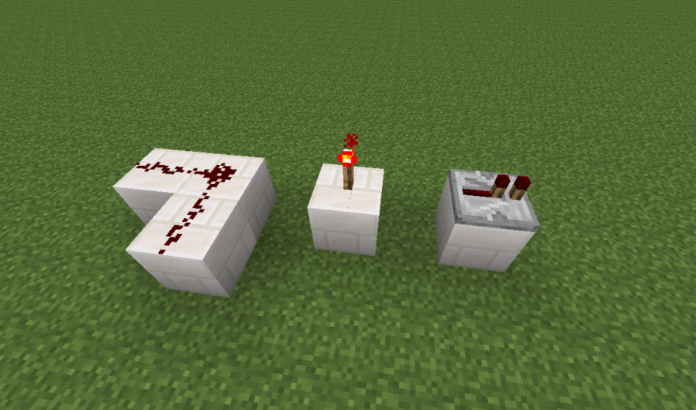
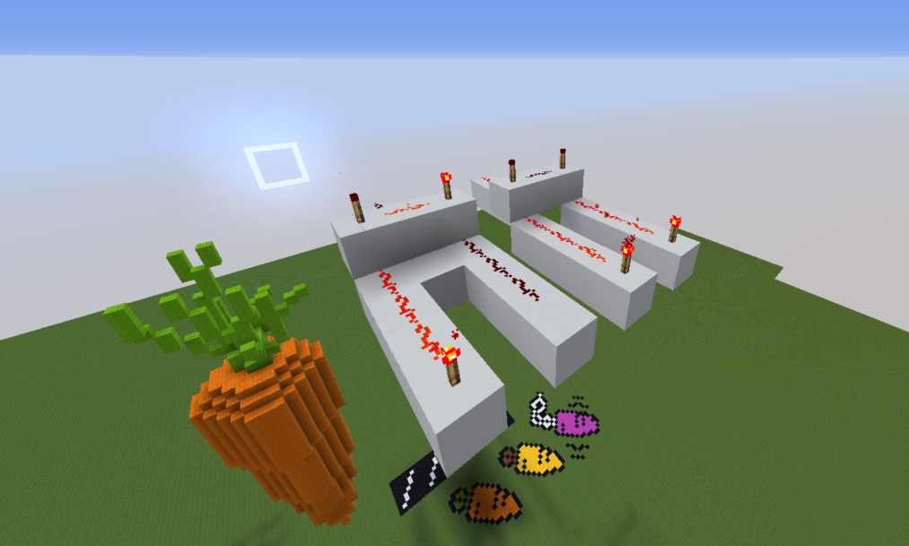
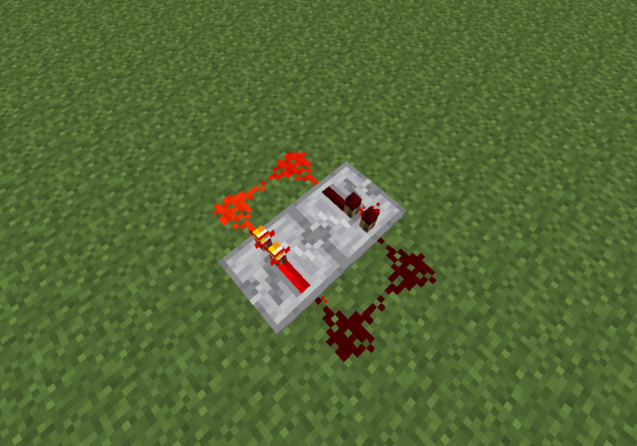
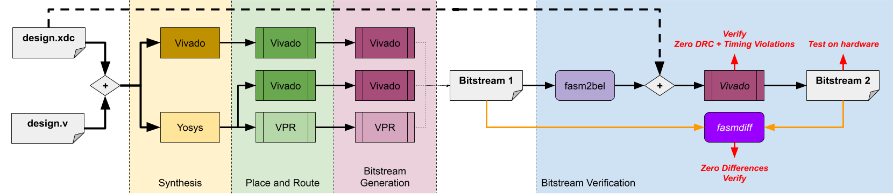

# Processeur Minecraft

## Introduction et motivations

### Minecraft

Minecraft est un jeu vidéo de type "sandbox" formé (presque) entièrement de cubes, que l'on peut miner et poser à volonté^[selon le mode de jeu, mais ceci est beyond the scope of ce rapport]. Le bloc (=cube) est l'unité prindipale du jeu, mesure de l'ordre de 1 mètre (si on supposse que le personnage mesure 1.80m). On joue à Minecraft dans des "mondes", générés procéduralement (à grand renfort de bruit de Perlin) et mesurant 60M * 60M * 256 blocs. 

Bien sûr, un monde n'est pas entièrement généré à sa création, d'une part parceque le fichier serait gigantesque, d'autre part parce qu'un monde de 60M*60M blocs (horizontalement) est absolument immense, seul une infime portion serait en pratique utilisée par les joueurs. Le monde est donc généré à la volée lorsque des joueurs s'aventurent dans des portions encore inconnues du monde. 

Aussi, pour des raisons évidentes de performances, tout le monde n'est pas entièrement chargé^[par "chargé", on entend que les animaux, monstres, la gravité, les méchanismes, etc. sont calculés, par opposition à "déchargé" qui signifie que la portion du monde en question est figée] à tout moment. À un moment donné, seule une portion du monde correspondant à un disque de rayon ~ 160 blocs autour de chaque joueur est chargée. Ceci limite donc la taille des circuits que nous pouvons créer : si un circuit est plus grand que 320 blocs, il se pourrait que des zones de ce dernier se retrouvent déchargées (donc figées) tandis que d'autre zones sont chargées. Cela peut conduire à des comportements inattendus!

### Redstone 101

La redstone est une poudre que l'on peut placer au sol pour créer des circuits logiques. Un fil peut être "alimenté" ou non, ce qui correspond à l'état logique haut ou bas. L'état d'alimentation est en fait un peu plus compliqué que cela : un fil de redstone a 16 niveaux d'alimentation possibles. la portion du fil située juste à côté d'une source est alimentée au niveau 15, puis la puissance décroît d'un niveau par bloc (donc un fil de redstone pert sa puissance au bout de 15 blocs^[D'où l'usage de répéteurs]). 


Nous avons plusieurs éléments intéressants dans le jeu :

- poudre de redstone : pour faire des fils
- torche de redstone : peut alimenter des fils. Mais si elle est elle-même alimentée par une autre source, elle s'éteint -> porte NOT primitive
- répéteur : permet de booster la puissance d'un fil : si le fil en entrée a une puissance d'au moins 1, la puissance en sortie sera de 15 (sinon, elle sera nulle). Le répéteur sert aussi de diode ou de registre à décalage.



\newpage

La redstone est par construction un circuit logique synchrone : (tout comme le reste de ce qui se passe dans un monde Minecraft) l'état des différents composants de redstone est calculé^[Lorsque les performances du serveur le permettent] `10` fois par seconde (on parle de `10` 'ticks' par seconde). La propagation de l'alimentation dans un fil de redstone est instantanée (`i.e.` elle est entièrement calculée durant un seul tick).

Voilà un exemple de porte AND faite en redstone :

\newpage



NB : Il y en a deux versions. Celle de gauche n'a qu'une seule entrée allumée, celle de droite a les deux.

Le principe est assez simple : Chaque entrée alimente une torche de redstone. Ces deux torches (appelons-les T0 et T1) alimentent, ensemble, une même torche (T2), qui, elle, alimente la sortie. Lorsque qu'au moins une des entrée est éteinte, T0 ou T1 n'est pas alimentée, donc est allumée. Donc elle alimente T2, qui est donc éteinte, résultant en une sortie éteitne.

À l'inverse, si les deux entrées sont alimentées, T0 et T1 sont éteintes (car toutes les deux alimentées). Donc T2 n'est plus alimentée, donc est allumée et la sortie est alimentée.

Les répéteurs sont un élément fondamental de la logique redstone : ils permettent d'induire un délai dans la propagation de signaux de redstone. En effet, la sortie d'un répéteur a `1`^[ou 2 ou 4 selon la configuration] tick de retard sur l'entrée.

On peut par exemple faire facilement une clock à `1` tick avec deux répéteurs.



## Difficultés techniques

Dès le début, il nous a apparu clair que toutes les difficultés dans ce projet ne résidaient pas dans la conception théorique du CPU (car c'est un CPU très simple, proche des exemples présentés en cours/TD) mais bien dans l'implémentation pratique dans Minecraft, et cela pour plusieurs raisons :

- Les fils de redstone perdent `1` de puissance tous les blocs et les repeaters ajoutent au moins `1` tick de délai. De qui fait que chaque `160` blocs parcourus par un signal prend `1` seconde. À l'échelle du CPU entier, nous pouvions donc nous retrouver avec des dizaines de secondes par instruction liées uniquement au temps de propagation des signaux dans les fils (on ne parle même pas encore de logique, là!)
- Minecraft est un jeu très mal programmé et la redstone ne fait pas exception... Il y a beaucoup de bugs (des éléments qui restent dans un état alimentés alors qu'il devraient être éteints, etc.) qui rendent très compliquée la tâche de faire un CPU assez petit pour éviter de prendre plus de 30 secondes par cycle! Il y a même des bugs qui ont lieu ou pas selon l'orientation des composants où même leur position dans le monde...
- Chaque bloc doit être posé à la main^[Nous avons des outils pour dupliquer des portions du monde, mais nous devons tout de même faire beaucoup de placement manuel!], donc n'importe quel petit composant de logique peut prendre beaucoup de temps à placer. Cela limite grandement la compléxité du CPU que nous avons fait.

## ISA

### Buts recherchés

Nous sommes partis sur une ISA très minimaliste et simple, avec le moins possible d'instructions. Nous nous sommes fondés sur l'ISA `RV8I` pour former notre ISA : V-RISC-V (Very Reducd Instruction Set Computer -V). Le nombre très réduit d'instructions nous a aidés à implémenter le CPU dans Minecraft.

De façon générale, voilà les specs de l'ISA :

- entiers sur 8 bits
- instruction sur 32 bits
- opérations d'arithmétique entière et logique bit-à-bit
- ROM et RAM séparées

### Registres

Nous avons suivi la même approche que dans les ISA RISC et nous nous sommes donnés `16` registres *general purpose* sur 8 bits : `%0` à `%15`. Sur ces `16`, `13` sont vraiment des registres génériques et nous avons trois registres spéciaux :

- `%0 = 0` → NOP
- `%1 = -1` → NOT
- `%15 = random(0, 255)`

Ces registres spéciaux ont chacun une utilité, que nous allons détailler dans la sous-section suivante.

### Instructions

Notre ISA a 8 instructions :

- STORE
- LOAD
- ADD
- OR
- XOR
- LOADI
- JMP conditionnel avec plusieurs flags possibles :
    * JOF : jump si overflow sur l'ALU
    * JNEG : jump si le résultat de l'ALU est négatif
    * JZ : jump si le résultat de l'ALU est nul
    * JMP : jump sans condition


Ces instructions sont suffisantes pour les programmes qu'il est possible de faire fonctionner sur un CPU dans Minecraft. Il y a très peu d'instructions, ce qui est motivé par les difficultés techniques que nous avons évoquées plus haut : faire un CPU dans Minecraft capable de décoder et d'exécuter des dizaines d'instructions est une tâche assez titanesque, bien au-delà de nos moyens. Ainsi, nous avons réduit fortement le nombre d'instructions, tout en prenant parti de quelques registres spéciaux nous permettant astucieusement d'avoir plus d'instructions gratuitement :

- NOP : comme dans RISC-V^[à ceci près qu'en RISC-V c'est un ADDI] : `ADD %0, %0, %0`
- SUB : Il suffit de faire un NOT suivi d'une incrémentation puis un ADD
- PRINT : On peut afficher des mots à l'écran en écrivant aux bons endroits dans la RAM (cf plus loin)
- JMP (inconditionnel) : il suffit d'utiliser le flag "toujours vrai"
- MOV : On fait un `ADD source, %0, destination`
- NOT : `XOR source, %1, destination`
- CMP : `ADD op1, op2, %0`. Cela permet de positionner les flags sans écrire dans un registre le résultat

De plus, il nous a semblé intéressant d'avoir un registre aléatoire built-in : Cela permet de faire des programmes rigolos, comme l'approximation de Pi par Monte-Carlo, en utilisant une 'primitive' de RNG hardware, donc faite en un cycle, plutôt que de faire un générateur congruentiel en software, qui serait horriblement lent.

### Composition des mots

Un point de divergence majeure avec RISC-V est la construction de nos instructions.

### Assembler

Nous avons implémenté un assembler basique pour transpiler nos programmes en ASM custom vers du langage machine V-RISC-V.

Par exemple, voilà un programme en ASM pour calculer $\frac{6}{\pi^2}$ par une approximation de la probabilité que deux entiers soient premiers entre eux :

```asm
.main
	mv %1 %5
	mv %0 %6
	loadi 1 %7
.rand
	add %0 %5 %0
	jz print
	add %1 %5 %5
	mv %15 %2
	mv %15 %3
.euclide
	sub %2 %3 %0
	jz proba
	sub %2 %3 %0
	jneg case2
	sub %2 %3 %2
	jmp euclide
.case2
	sub %3 %2 %3
	jmp euclide
.proba
	add %1 %3 %0
	jz relatively_prime
	jmp rand
.relatively_prime
	add %7 %6 %6
	jmp rand
.print
	print %6 0
	halt
```

Et voilà une horloge :

```asm
.init
	loadi 0 %2 # Seconds.
	loadi 0 %3 # Minutes.
	loadi 0 %4 # Hours.
	loadi 1 %5
	loadi 59 %6
	loadi 23 %7
.print_hour
	print %2 0
.print_min
	print %3 1
.print_sec
	print %4 2
.sec
	# Add a second.
	add %5 %2 %2
	# Check if there is a roll over.
	sub %6 %2 %0
	jneg min
	# Update the screen and loop.
	jmp print_sec
.min
	# Reset the seconds.
	loadi 0 %2
	# Add a minute.
	add %5 %3 %3
	# Check if there is a roll over.
	sub %6 %2 %0
	jneg hour
	# Update the screen and loop.
	jmp print_min
.hour
	# Reset the minutes.
	loadi 0 %3
	# Add an hour.
	add %5 %4 %4
	# Check if there is a roll over.
	sub %7 %2 %0
	jneg halt
	# Update the screen and loop.
	jmp print_hour
.halt
	jmp halt

```

## Implémentation

### Principe général

### Modules

### Assemblage

## Conlusion

### Achievements

### TODO


# Processeur RISC-V

## Introduction

Nous allons décrire les différents travaux effectués autour du processeur RISC-V.

D'abord, nous allons décrire directement le processeur, puis les mécanismes d'interruptions.
Ensuite, nous allons décrire la tentative d'écriture d'un cache L1, d'une MMU tout cela en utilisant une interface Wishbone B4.
Puis, nous allons décrire notre transition de Verilog à System Verilog et Icarus Verilog à Verilator.
Ensuite, nous expliquerons notre stratégie de tests et de vérification du processeur qui n'a pas été complètement implémenté.
Puis, nous expliquerons les (non-)travaux qui ont été fait avec le FPGA et plus généralement notre toolchain GCC et un peu de Nix.^[Avouez que vous avez sourit quand vous avez vu que j'ai écrit Nix, je sais.]
Enfin, nous expliquerons l'état d'avancée en ce qui concerne le fait de faire tourner des systèmes d'exploitations comme FreeRTOS ou Linux.^[Bon, c'était dur de faire croire qu'on savait manipuler la langue en alternant « ensuite » et « puis ».]

À chaque fois, nous expliquerons les difficultés rencontrées, les façons de les résoudre ainsi que ce qui n'a pas été fait^[Et donc ce qui aurait dû être fait, mais qui sera fait pour notre prochaine dream team qui fabriquera un HSM parfait, low-cost pour disrupt le marché et faire des Unicorns.].

## Gagner plus en travaillant moins: Pipeline

Ce processeur implémente la pipeline standard en 5 étages :

 * Récupération de l'instruction
 * Décodage
 * Exécution
 * Accès mémoire
 * Écriture retour

Nous avons choisi d'optimiser la pipeline en mettant en place un système de
forwarding entre les étages.
Grâce à l'architecture RISC-V, il suffisait d'implémenter le forwarding entre l'étage EXE
et les étages MEM et WB : chaque étage déclare l'éventuel registre dans lequel il écrit
et les autres obtiennent (grâce à l'unité de forwarding) une vue sur l'état des registres
qui correspond à ce que sera l'état des registres _après_ que les étages suivant
auront écrit leurs données.

_On pourrait éviter de relier l'étage WB à l'unité de forwarding,
mais des contraintes techniques liées au timing sur Verilog nous ont poussés
à choisir cette stratégie, même si elle implique d'utiliser un peu plus
de circuits._

Nous avons implémenté un début de système de prédiction de branche -- mais sans aller
jusqu'à faire des statistiques à la volée sur l'exécution des programmes.
Nous avons décidé de toujours prédire que les branches ne seront pas prises
(ce qui était la solution la plus simple).
En prévision des cas où nous nous trompons sur ces prédictions, nous avons
ajouté dans le processeur un signal `KILL` qui sert à vider toute la pipeline.

L'ISA RISC-V est conçue pour permettre d'implémenter raisonnablement facilement
cette pipeline, nous ne nous sommes donc pas heurtés à de trop gros problèmes
^[Ce qui ne nous a cependant pas empêchés de passer quelques moments à nous
battre contre Verilog pour comprendre comment faire exécuter les opérations
logiques dans l'ordre prévu.].

## De l'art de dire non: Synchronisation avec la mémoire

Comme nous voulions avoir un système de mémoire évolué, nous avons dû
prévoir les cas où les appels à la mémoire prendraient un temps
arbitrairement long.

Pour cela, nous avons un signal `STALL` qui bloque les étages `IF`, `ID`,
`EXE` et `MEM` dans leur état courant en attendant un signal de type `ACK`
de la part de la mémoire.

Ceci a aussi demandé d'implémenter une petite machine à états dans l'étage MEM :

 * Soit on suit une exécution normale
 * Soit on est en train d'attendre des données de la mémoire

## De l'art d'exceller à 1, 2, 3, soleil: Mécanismes d'interruptions

## De l'art de mentir vite et bien: Caches L1, MMU et Wish(bone)

Puisque on nous a dit de pas le faire, nous avons malgré tout essayé, puis c'était très formateur et requis pour Linux.

Nous avons décidé d'opter pour Wishbone B4: <https://cdn.opencores.org/downloads/wbspec_b4.pdf> — une spécification libre de bus, pas trop mal, assez haute performance.
Mais il a fallu du temps pour la comprendre.

### La théorie des caches

Un cache CPU sert à économiser (beaucoup) de cycles afin de soulager le CPU et l'empêche de bloquer autant que possible.

Le contexte étant qu'un système mémoire peut prendre jusqu'à 100 ou 250 cycles afin de répondre à une requête donnée, le cache apparaît comme absolument nécessaire.

#### Objectifs

Nous voulions donc designer un cache qui remplit plusieurs objectifs:

- On peut, à tout cycle, écrire. Il faut donc mettre à jour le cache aussitôt qu'on écrit pendant qu'on écrit au système mémoire.
- Une lecture à une adresse non cachable va directement au système mémoire.
- Une lecture à une adresse cachable, contenue dans une ligne de cache déjà accédé, se voit donner une réponse instantanément.
- Une lecture à une adresse cachable, contenue dans une ligne de cache non accédé, se voit donner une réponse en deux cycles.
- On veut écrire au système mémoire à une vitesse très grande et ne pas refaire des handshakes Wishbone B4 en permanence, il faut donc un mécanisme de burst.
- On veut rendre le cache configurable pour des bus mémoires de tailles arbitraires pour expérimenter les performances.
- On se contente d'un algorithme de remplacement aléatoire avec un LFSR^[Linear Feedback Shift Register.].
- On se contente d'un tampon pour stocker les écritures lorsqu'on peut pas écrire toute de suite dans le cache, mais on veut quand même rendre visible les données qui sont dans notre tampon si on en a besoin.

#### Concrètement

Nous avons opté pour un « 2-way associative, allocate on write, with pipelined writeback buffer, with random replacement policy, L1 cache ».

En lisant la littérature, il nous apparaissait que 2 tableau d'entrées était suffisant pour assurer une performance décente, et ça ne demande pas plus d'effort que d'en faire $N$ sur le fond, l'allocation en écriture était un objectif, un tampon pipeliné c'était aussi un objectif pour les vitesses.

Nous nous décrirons pas la machine à état précise pour effectuer ces opérations, elle n'existe que dans la tête de l'auteur de façon partielle et ne reflète pas la réalité du problème, qui est plutôt de vivre en coopération avec les autres composants.

### Problèmes rencontrées

- Pas de méta-programmation dans System Verilog malgré les structures qui nous font rappelé le bon C qui nous manquait ;
- Deux machines à état: une pour le processeur, une pour le système mémoire, c'est pas évident à coordonner ;
- Le processeur écrit trop vite et certaines interfaces étaient burst-friendly et d'autres moins, il n'était pas clair comment arbitrer tout ça facilement sans introduire encore plus de complexité

En somme, beaucoup trop de bugs ont été rencontrés.

### La MMU

Dans la foulée, l'auteur a eu une bonne idée qui était, afin de gagner du temps, d'intégrer le support MMU dans le cache L1 directement, i.e. de supporter des adresses virtuelles à charger et des tables de permissions.

Un début d'implémentation vague a été esquissé, perdu dans un stash git. Une autre idée aurait été de l'implémenter en software en C directement quitte à payer les pénalités de performance « juste pour voir », mais l'auteur trouvait ça honteux.

Pas grand chose de plus pourrait être dit sans juste ré-expliquer ce qu'est une MMU.

## Des ailes d'acier à la brûlure: Verilator et Icarus Verilog

Au début, nous utilisions Icarus Verilog, qui a permis de rapidement tester
notre implémentation.

Mais nous avons rapidement ressenti le besoin de plus instrumenter notre processeur,
nous avons donc migré vers Verilator, qui est un compilateur de Verilog
vers C++. Grâce à cela, nous avons pu avoir plus de contrôle sur la simulation,
en particulier nous sommes en mesure de lire et d'écrire directement la mémoire,
ce qui permet d'implémenter des entrées-sorties pour l'utilisateur.
En particulier, c'est ce qui nous permet de nous synchroniser au temps réel
et d'afficher proprement l'heure.

## Retrouver sa patrie: System Verilog

Nous avons aussi migré de Verilog vers System Verilog car nous avions besoin
d'un langage plus expressif alors que la complexité du projet augmentait.

Les systèmes de structures et les raffinements sur les définitions des tableaux
apportés par System Verilog nous ont facilité grandement facilité la tâche
lors de l'écriture du système de mémoire (et surtout du cache L1).

## Parce que prier n'est pas une stratégie: Stratégie de tests et vérification

Il était clair que si nous avions implémenté la moindre chose un petit peu complexe et que certains programmes C tournaient avec des sorties raisonnables.

Cela n'apportait aucune garantie de correction de notre processeur. Frustré, nous avons décidé de mettre le paquet.

### Sous Icare

Dans un premier temps, nous utilisions essentiellement Icarus Verilog et une raison de la transition, c'était aussi la capacité de contrôler le modèle de co-simulation finement.

Ainsi, sous Icare, il n'y avait pas beaucoup d'espoir de vérifier notre processeur, si ce n'est qu'avec des tests unitaires classiques.

### De la nécessité d'avoir un permis pour torturer

**Attention ce qui suit est presque un mythe, i.e. n'a pas été testé jusqu'au bout.**

Sous Verilator, nous avons décidé de forker la batterie de tests de compliance de RISC-V: <https://github.com/riscv/riscv-compliance> afin de lancer les tests sur notre CPU.

Ces tests ont une couverture relativement complète de l'ISA et permettent d'avoir une bonne idée du niveau d'implémentation obtenu, cependant ils requièrent de coupler nos modèles avec notre processeur car il s'agit de self-test, donc il faut pouvoir récupérer les signatures à la fin afin de les comparer.

Notre implémentation était très proche de celle de `ri5cy`: <https://github.com/riscv/riscv-compliance/blob/master/riscv-target/ri5cy/device/rv32imc/Makefile.include> qui recourt à de la simulation en utilisant `vsim`, nous pouvions remplacer celle-ci par un test-bench bien choisi avec Verilator pour instrumenter la mémoire et récupérer les signatures dont nous avions besoin.

Malheureusement, cela n'a pas été fait jusqu'au bout (comme dit en gras), vous retrouverez un embryon d'adaptation ici: <https://github.com/RaitoBezarius/riscv-compliance/commit/15c1e71b280316f0e18a72fba55bae8fdaa81e99>.

Une fois ceci fait, on ajouterait une target `test-compliance` qui permettait d'assurer les fonctionnalités, ce qui nous paraîtrait nécessaire dans une vraie implémentation.

Et finalement, on aurait ajouté cela dans un CI/CD^[Ce qui aurait satisfait aux contraintes de développement moderne de l'énoncé du projet.] afin de tester en permanence chaque commit qui pourrait modifier le CPU et s'assurer de ne rien casser, i.e. d'y voir plus clair.

### De la nécessité d'avoir un permis tout court

De façon plus générale, il nous paraissait vital au bout d'un moment d'assurer les choses sérieusement et pas juste de croire aveuglément.^[De toute façon, les processeurs sont le fruit d'un esprit malade.]

Donc, pas le choix, vérification formelle, nous présentons brièvement l'outillage employé.

#### SymbiYosys

SymbiYosys: <https://symbiyosys.readthedocs.io/en/latest/index.html> est un programme de vérification formelle de designs écrit en (System) Verilog à l'aide de solveurs, il utilise SymbiFlow pour travailler sur les objets du design et en émettre des représentations de SAT/SMT et les donner à des solveurs SMT/SAT afin d'en tirer des résultats et reconstruire les contre exemples ou valider.

Il supporte la vérification bornée (Bounded Model Checking), non-bornée ($k$-induction), peut générer des cas d'exécution pour des propriétés (i.e. est ce qu'il existe une trace où tel signal est allumé?).

Dans un futur incertain, il supporterait la vérification d'équivalence formelle (deux représentations de circuit ont le même comportement) et la synthèse réactive (i.e. génération automatique de machine à états depuis des spécifications de haut niveau, type formule de la logique temporelle linéaire).

#### Bounded Model Checking

On travaille dans un modèle de logique temporelle linéaire et on transforme ça en un problème SAT.

Le problème demeure que l'on peut dérouler seulement à une profondeur finie, tant qu'on ne connaît pas la profondeur maximal requise^[Qui existe, puisque tout est relativement fini.] pour prouver de façon certaine que notre design est valide, nous sommes confrontés à un problème d'équilibre entre augmenter la profondeur et rendre la vérification plus lente.

Nous verrons dans la suite comment lever ce problème conceptuel.

Cela dit, cela fournit des traces contre-exemples et en pratique produit des contre-exemples de 20 à 30 cycles dans certains cas, ce qui est largement plus efficace que de la simulation avec des prints avec des cas manuels !

#### $k$-induction

Afin de prouver des propositions sur des domaines infinies, on peut recourir à la $k$-induction.


**Principe** :

Supposons que $P(0), P(1), \ldots, P(k - 1)$ soit vrai.

Et que pour tout $n \in \N$, si $P(n), P(n + 1), \ldots, P(n + k - 1)$ est vrai, alors $P(n + k)$ est vrai.

---

L'idée est la suivante, on vérifie nos propriétés dans les états initiaux, puis l'induction prend lieu pour les transitions de la machine à état fini en écrivant les propriétés que l'on veut conserver.

Cependant, on ne peut pas se contenter de raisonner pour seulement un état vrai pour prouver les suivants, il faut supposer $n$ états successifs qui sont vrais pour renforcer l'induction et la rendre plus facilement démontrable, en échange, on prouve qu'on a $n$ états initiaux successifs qui sont vrais.

Des techniques ont été développés pour transformer un tel problème en un problème SAT et de pouvoir montrer que dans ces instances, l'on peut même le résoudre de façon incrémentale ! (c.f. Temporal Induction by Incremental SAT Solving par N Eén).

#### Vérification formelle des block RAM

On retrouve la vérification formelle des block RAM ici: <https://github.com/RaitoBezarius/sysnum2020/blob/dcache/src/rtl/core/memory/block_ram.sv#L58>

L'idée étant simple, on veut pouvoir vérifier que le block RAM se comporte bien de façon seule et de façon intégrée, on suppose le bon comportement des frontières, ou on s'assure qu'il est effectivement juste.

Puis, on se donne des adresses aléatoires valides, on y suppose qu'il existe de la données puis on soumet de la requête et on vérifie qu'on obtient les données et que les signaux des interfaces se maintiennent pendant le bon nombre de cycles.

Puis, on donne ça à SymbiYosys: <https://github.com/RaitoBezarius/sysnum2020/blob/dcache/src/rtl/core/core.sby> — en paramétrant avec différents solveurs de $k$-induction et de BMC, et différents paramétrages des block RAM.

Il aurait fallu ajouter une target dans notre Makefile afin de lancer la vérification formelle mais nous lancions la commande à la main, ce qui était suffisant.

#### Tentative de vérification formelle d'un cache L1

Il aurait fallu vérifier cette abomination: <https://github.com/RaitoBezarius/sysnum2020/blob/dcache/src/rtl/core/cache/dcache.sv>

Pour l'approcher, même méthodes que le block RAM mais en plus, avec des modèles de co-simulation, on peut torturer le cache et créer des situations d'incohérences observables puis on écrit la propriété nécessaire pour la faire disparaître.

Le souci c'est qu'écrire un cache **et** le vérifier formellement en même temps est très difficile car c'est une cible mouvante en permanence.

Il faut ou bien choisir d'écrire la spécification au début (donc savoir comment se comporte vraiment un cache) ou bien d'écrire le code (donc savoir comment se comporte vraiment un cache), et dans les deux cas, il y avait trop peu de temps pour le faire.

Techniquement, lancer un test intégré grâce aux block RAM fournit déjà un début de formalisation puisqu'on peut vérifier si le cache L1 utilisent correctement les blocks RAM, i.e. la tag RAM et la data RAM.

## Tester c'est tricher: FPGA et déboires

### Vivado c'est non.

OK, Vivado c'est bien si on veut dessiner des designs, mais il ne faut pas oublier une chose, Vivado c'est fait par Xilinx et c'est une boîte qui est là pour vendre des FPGA.

Autrement dit, leur logiciel est une usine à gaz, d'une vingtaine de gigaoctets^[Espace précieux sur mon SSD d'1 téraoctets], comparable à Matlab.

Au delà des oppositions idéologiques concernant le fait que la toolchain ne soit pas open source, l'on remarque plusieurs choses:

- Ce n'est pas efficace, ça n'a pas été conçu pour la productivité ;
- Ce n'est pas rapide, l'interface est lourde et lente et ne fonctionne pas très bien sur des window managers de power user ;
- L'installation est un processus magique qui écrit partout où ça veut et c'est difficile à packager proprement ;
- **Pire: ça optimise mal.** — oui, le but de Xilinx c'est de vendre des FPGA toujours plus gros, pourquoi ça irait enlever l'AXI slave bridge même si on utilise pas le bloc avec
leurs IPs ? Idem pour la DDR3, 70% du composant est dans la calibration qui est un processus dont on a besoin seulement une fois au démarrage du système ;
- **Encore pire: ça échoue à la fin** — Vivado est conçu pour échouer plus tard et accepte les erreurs, tandis que les outils qu'on a utilisé pendant le projet ont tendance à échouer tôt et à crier au moindre souci, ce qui est plus plaisant d'un point de vue du développement ;
- J'ai réussi à créer une alerte de revue manuelle pour les contrôles d'exportations de logiciel américain avec le site de Xilinx et donc je ne pouvais pas télécharger Vivado. :)

Si c'était à refaire ? Nous aurions utilisé <https://github.com/enjoy-digital/litex> directement et <https://github.com/m-labs/nmigen>, mais c'est pas assez.

### Nix c'est oui.

Nous devions parler de toolchain, effectivement, nous avons utilisé GCC, sauf que configurer une toolchain de cross-compilation n'est pas chose aisée, donc nous avons reposé sur 30 lignes très simples de Nix:

```nix
with import <nixpkgs> {
  crossSystem = (import <nixpkgs/lib>).systems.examples.riscv32-embedded // {
    platform = {
      name = "riscv-soft-float-multiplatform";
      kernelArch = "risc";
      kernelTarget = "vmlinux";
      bfdEmulation = "elf32lriscv";
      gcc.arch = "rv32im";
    };
  };
};

let
  hostNixpkgs = import <nixpkgs> {};
  elf2hex = hostNixpkgs.stdenv.mkDerivation {
    pname = "elf2hex";
    version = "1.0.1";
    depsBuildBuild = [ stdenv.cc ];
    buildInputs = [ hostNixpkgs.python3 ];
    configureFlags = "--target=riscv32-none-elf";
    src = fetchurl {
      url = "https://github.com/sifive/elf2hex/releases/download/v1.0.1/elf2hex-1.0.1.tar.gz";
      sha256 = "1c65vzh2173xh8a707g17qgss4m5zp3i5czxfv55349102vyqany";
    };
  };
in
  mkShell {
    name = "riscv-toolchain-shell";
    nativeBuildInputs = [ elf2hex hostNixpkgs.symbiyosys hostNixpkgs.verilator ];
  }
```

Et voilà, on a Verilator, `elf2hex`^[Qui est un petit truc pratique de SiFive pour transformer des ELF en hex que Verilog aime bien.] et une toolchain `gcc` supportant nos usages (i.e. soft floats), ainsi que SymbiYosys, qui est notre outil de vérification formelle.

À noter, compiler GCC pour ces targets peut être ennuyeux, mais grâce à la gentillesse de l'ENS Ulm et du département du DI, nous avons obtenu un accès à Safran 2 qui nous a permis de l'utiliser comme machine de construction Nix pour envoyer tout ça dans un cache, voici une illustration.


Donc, cela ne coûtait virtuellement rien de faire cela.

### Enter: SymbiFlow, the GCC of FPGA.

OK, il nous faut une toolchain open source, fort heureusement, des gens bien ont inventé SymbiFlow.

Cet outil fournit de bien meilleures performances que Vivado en termes de consommation, en échange d'abandonner tout espoir d'utiliser un IP Vivado-specific.

En revanche, il repose sur une base de données de familles d'appareils supportés, notre Arty S7-50 n'est pas supporté à ce jour.^[Mais il le sera bientôt. :>]

Nous expliquons comment le supporter au prochain point.

Cet outil nous aurait été bien utile afin de travailler plus vite avec le FPGA.

### Mieux que tester: fuzzer.

Pour ajouter une nouvelle famille à SymbiFlow, il faut comprendre ce que Vivado fait, pour comprendre ce que Vivado fait, il y a un raccourci.

On se donne un ensemble de designs « discriminants », on les donne à Vivado, on regarde le bitstream résultat et on conclut. Cela forme une base de données de spécimens.

Typiquement ces designs incluent juste une petite pièce d'un appareil: un block RAM par exemple, puis ensuite on fait varier ces designs en faisant varier les paramètres, en changeant des pins, par exemple.

Ensuite, on fait tourner un script TCL dans Vivado pour faire ces changements de paramètres plutôt que de charger $N$ modèles Verilog, on en charge qu'un seul.

Enfin, en observant tous les spécimens, on peut corréler **quel** bit dans quel zone correspond à un choix particulier dans le design.

Ainsi, on peut implémenter la compréhension automatique de la génération de bitstream de Vivado et produire une toolchain qui reproduit avec un niveau de fiabilité extrêmement élevé le comportement de Vivado.



## L'espoir est la confusion d'un désir pour quelque chose et sa probabilité: FreeRTOS et Linux

### FreeRTOS

Nous avons porté une version de FreeRTOS relativement et raisonnablement utilisable ici: <https://github.com/RaitoBezarius/FreeRTOS/commit/127ece8f352b33c0faec46a7a2328e9030f18618>

Essentiellement, nous avons adapté le `Makefile` à notre propre pipeline et on a ajouté les sous-modules récursivement.^[Ne jamais faire ça sous Git, j'ai dû utilisé de la magie noire pour reset certains états qui n'ont pas été fixés, bref beaucoup de code non fiable dans les sous modules récursifs de Git…]

Mais comme nous n'avons pas eu le temps de ré-implémenter l'extension M, nous n'avons pas testé l'image engendré.

### Linux

Hélas, c'était mort. Effectivement, ceci existe: <https://www.kernel.org/doc/Documentation/nommu-mmap.txt> mais nous ne trouvions pas cela si intéressant que ça.

D'où la nécessité du cache L1 et de la MMU et des modes privilégiés.

Pire encore, Linux ne requiert pas que `RV32IM`, mais `RV32IMA` au moins.

Bien sûr, à ce stade là, nous n'aurions pas été capable de produire une implémentation convenable pour Linux sans tricher beaucoup trop pour avoir quelque chose de pas si intéressant que ça et le temps manquait.

Mais s'il fallait lister ce qu'il manque :

- Cache L1
- MMU
- Ajouter un mode privilégié
- Relier un peu toutes les choses
- Ajouter une fausse extension A en ramenant certaines opérations à des `nop` parfois et en priant beaucoup
- Implémenter M de façon simple (par exemple, la division avec Barrett !^[Toute ressemblance avec un examen existant est fortuit !])

C'est-à-dire, pas grand chose, si on se donne un nouveau semestre.

## Conclusion et leçons tirées : Que faire la prochaine fois ?

Déjà, utiliser LiteX ou nMigen la prochaine fois, travailler avec Verilog uniquement quand cela est extrêmement nécessaire.

Ensuite, mettre en place l'automatisation avec un `Makefile` le plus tôt possible et toujours automatiser dès le début.

Puis, avoir une personne qui se charge d'écrire une spécification formelle et une autre personne qui implémente, ne pas faire les deux en même temps, c'est trop de charge mentale.

Mais aussi, choisir un FPGA supporté par la toolchain si on est pas prêt à mettre les mains dans le cambouis avec SymbiFlow et le fuzzing automatique.

Enfin, écrire des modèles de cosimulations plus puissant et utiliser Verilator plus.

Nous tenons à faire remarquer l'existence d'un joli projet: <https://github.com/asinghani/pifive-cpu> qui a suivi une bonne façon de faire et a abouti à un beau résultat.
