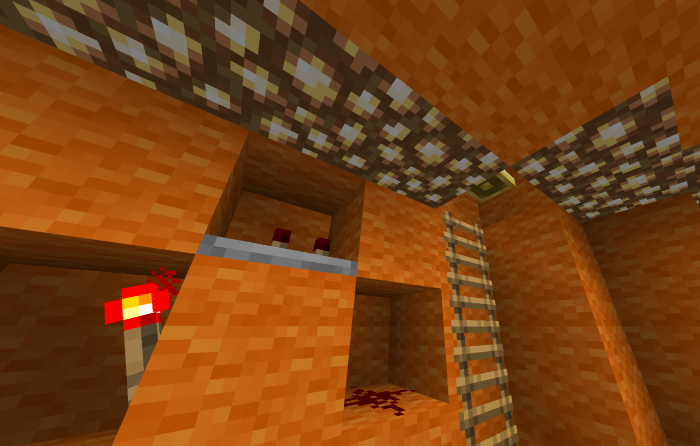
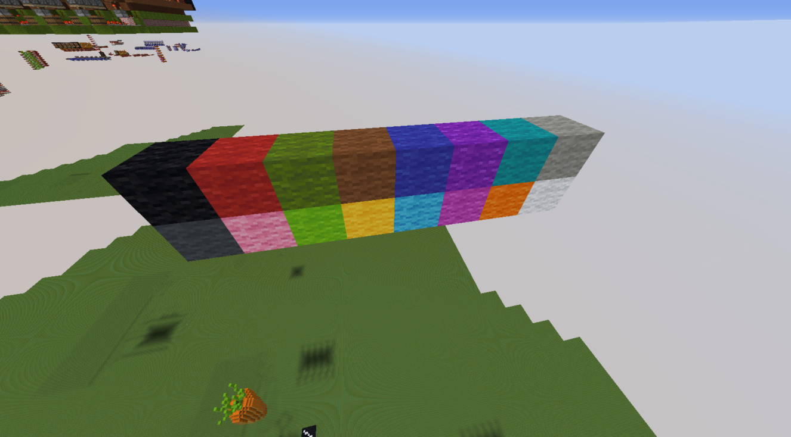
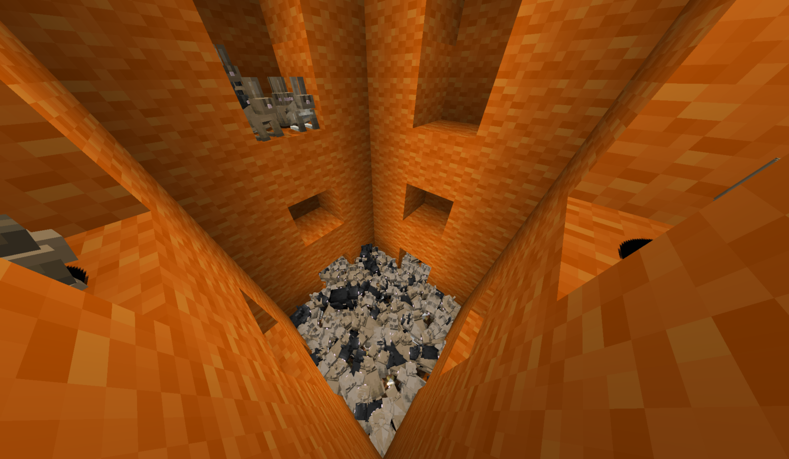
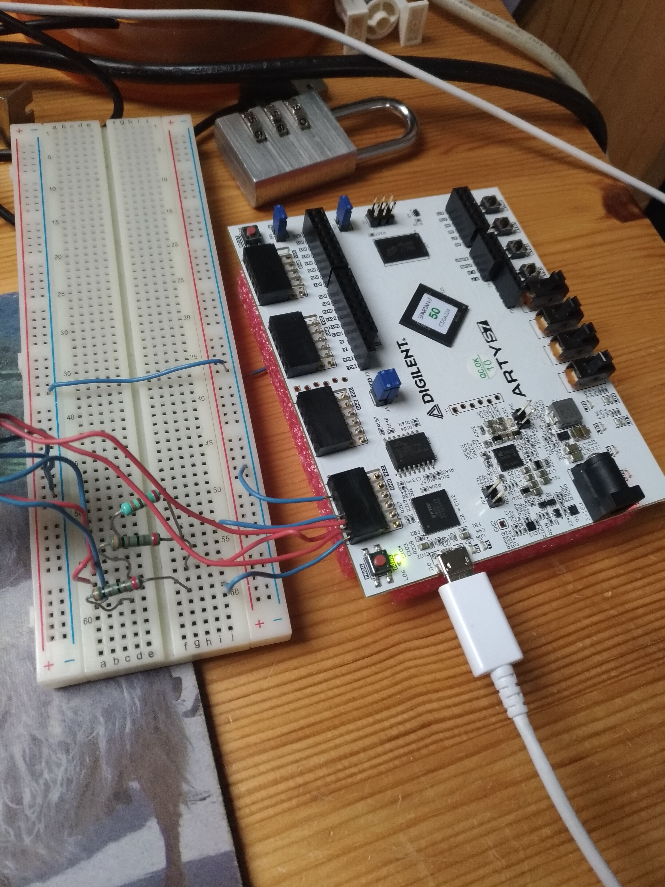
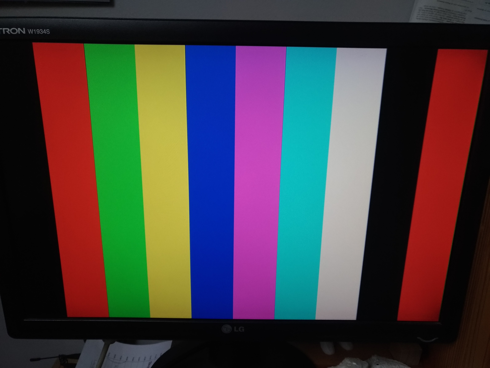
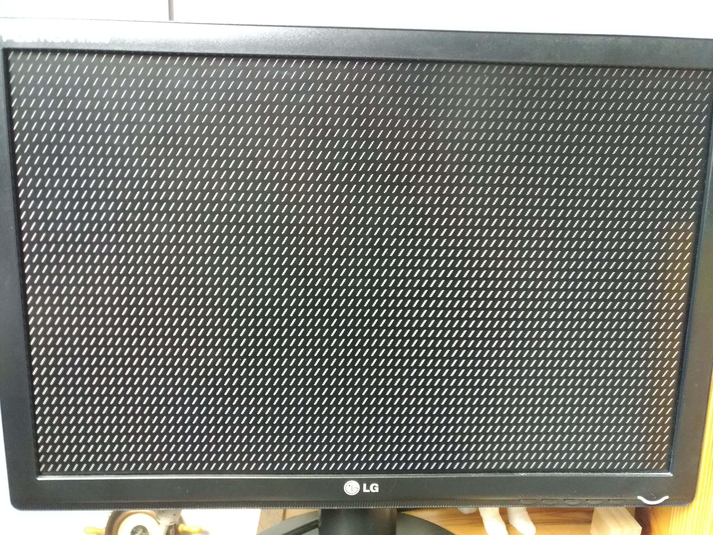

# Introduction

## Parce que c'est notre projet !

Le projet se divise en deux sous-projets :

- Le processeur Minecraft avec l'ISA V-RISC-V^[Invention de cerveaux malades.] ;
- Le processeur RISC-V écrit en System Verilog et simulé avec Verilator

## Plan pour Minecraft

> - Motivations
> - Redstone
> - ISA
> - Détails d'implémentation

## Plan pour RISC-V

> - Fonctionnalités principales du processeur: extensions, entrées-sorties
> - Prototypes
> - Icarus Verilog → Verilator et Verilog → System Verilog
> - Caches, MMU 
> - Wishbone
> - Vérification formelle avec SymbiFlow
> - Contrôleur VGA

# Minecraft

## Motivations

**Minecraft :** circuits logiques avec de la redstone^[cf slide suivante].

. . .

Déjà quelques implémentations existantes de CPU plus ou moins complexes.

. . .

**But :** implémenter un CPU 8-bits simple dans Minecraft; contraintes surtout liées au jeu.

## Redstone

**Redstone :** poudre qui, placée au sol, forme des fils. Valeurs : 0 ou 1^[Subtilité : il y a des histoires de puissance... Out of the scope pour cette présentation].

. . .

Un agencement d'éléments (fils de redstone, torches de redstones, blocs, etc.) forme un **circuit logique combinatoire**. Propagation non instantanée : facteur à prendre en compte (naïvement, `>= 0.1` seconde pour qu'un signal parcourt 16 blocs) → limitation en taille.

. . .

Quelques timings ajustés et des fonctionnalités de Minecraft permettent de faire des latchs : sauvegarde de données.

## Exemple redstone

## Exemple redstone

## ISA : V-RISC-V

V-RISC-V = Very Reduced Instruction Set Computer (-V pour le jeu de mot)

Données sur 8 bits, instructions sur 32 bits (pourt l'instant 26 bits utilisés).

. . .

- STORE
- LOAD
- ADD
- OR
- XOR
- LOADI
- JMP conditionnel

. . .

`| pc : 1 | flag : 2 | or,carry,xor : 3 | read1 : 4 | imm : 0:3 | write : 4 | imm : 4:7 | read2 : 4`

## Pseudo-instructions

Avec les instructions de base et les registres spéciaux :

- NOP
- SUB
- HALT
- PRINT
- JMP (inconditionnel)
- MOV
- NOT 
- CMP

## Registres

16 general purpose^[Enfin dont 3 registres spéciaux] registers : `%0` to `%15`.

. . .

Largeur : 8 bits

. . .

Registres spéciaux :

- `%0 = 0` → NOP
- `%1 = -1` → NOT
- `%15 = random(0, 255)`

## Assembler

On a un assembler de notre ASM vers des commandes MC permettant de programmer des ROM dans Minecraft.

## Aspects techniques

## Laines

## Conclusion et ouvertures

**Achievements :**

CPU V-RISC-V avec ROM, registres, ALU, instructions arithmétiques et logiques.

. . .

**TODO :** 

RAM, I/O utilisateur^[O : afficheurs 7-segments; I : sélecteurs à leviers], découpage de l'espace mémoire, pipeline^[En fait déjà presque possible...]

## Conclusion

# Le processeur RISC-V (Sakaido, le brillant)

## Fonctionnalités principales

Il s'agit d'un processeur RISC-V qui implémente RV32I^[RV32IM était disponible à un moment].

## Contrôleur VGA

Contrôleur VGA `640x480`.

## Contrôleur VGA

## Contrôleur VGA

Affichage d'une matrice de caractères

