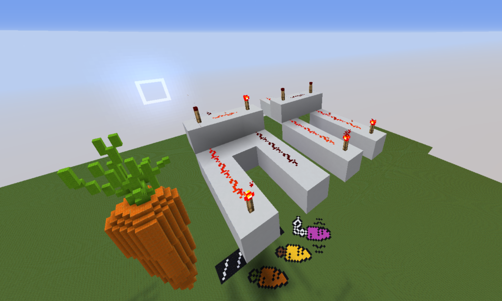

# Introduction

## Parce que c'est notre projet !

Le projet se divise en deux sous-projets :

- Le processeur Minecraft avec l'ISA V-RISC-V^[Invention de cerveaux malades.] ;
- Le processeur RISC-V écrit en System Verilog et simulé avec Verilator

## Plan pour Minecraft

> - Motivations
> - Redstone
> - ISA
> - Détails d'implémentation

## Plan pour RISC-V

> - Fonctionnalités principales du processeur: extensions, entrées-sorties
> - Prototypes
> - Caches, MMU 
> - Wishbone
> - Vérification formelle avec SymbiYosys
> - Contrôleur VGA

# Minecraft

## Motivations

**Minecraft :** circuits logiques avec de la redstone^[cf slide suivante].

. . .

Déjà quelques implémentations existantes de CPU plus ou moins complexes.

. . .

**But :** implémenter un CPU 8-bits simple dans Minecraft; contraintes surtout liées au jeu.

## Redstone

**Redstone :** poudre qui, placée au sol, forme des fils. Valeurs : 0 ou 1^[Subtilité : il y a des histoires de puissance... Out of the scope pour cette présentation].

. . .

Un agencement d'éléments (fils de redstone, torches de redstones, blocs, etc.) forme un **circuit logique combinatoire**. Propagation non instantanée : facteur à prendre en compte (naïvement, `>= 0.1` seconde pour qu'un signal parcourt 16 blocs) → limitation en taille.

. . .

Quelques timings ajustés et des fonctionnalités de Minecraft permettent de faire des latchs : sauvegarde de données.

## Exemple redstone

## Exemple redstone

## ISA : V-RISC-V

V-RISC-V = Very Reduced Instruction Set Computer (-V pour le jeu de mot)

Données sur 8 bits, instructions sur 32 bits (pour l'instant 27 bits utilisés).

. . .

- STORE
- LOAD
- ADD
- OR
- XOR
- LOADI
- JMP conditionnel

. . .

`| pc : 1 | flag : 2 | or,carry,xor : 3 | read1 : 4 | imm : 0:3 | write : 4 | imm : 4:7 | read2 : 4`

## Pseudo-instructions

Avec les instructions de base et les registres spéciaux :

- NOP
- SUB
- HALT
- PRINT
- JMP (inconditionnel)
- MOV
- NOT 
- CMP

## Registres

16 general purpose^[Enfin dont 3 registres spéciaux] registers : `%0` to `%15`.

. . .

Largeur : 8 bits

. . .

Registres spéciaux :

- `%0 = 0` → NOP
- `%1 = -1` → NOT
- `%15 = random(0, 255)`

## Assembler

On a un assembler de notre ASM vers des commandes MC permettant de programmer des ROM dans Minecraft.

## Aspects techniques

## Laines

## Protections hardware

## Conclusion et ouvertures

**Achievements :**

CPU V-RISC-V avec ROM, registres, ALU, instructions arithmétiques et logiques.

. . .

**TODO :** 

RAM, I/O utilisateur^[O : afficheurs 7-segments; I : sélecteurs à leviers], découpage de l'espace mémoire, pipeline^[En fait déjà presque possible...]

## Conclusion

# Le processeur RISC-V (Sakaido, le brillant)

## Fonctionnalités principales

Il s'agit d'un processeur RISC-V

- Implémente RV32I^[RV32IM était disponible à un moment]
- Implémentation pipelinée
- Système de mémoire avec entrées/sorties à 5 bus Wishbone et un adressage généreux ()
- **Non-fonctionnel** cache L1 "allocate-on-write avec un buffer de writeback, 2-way associative",
- **Non-fonctionnel** hardware MMU (c.f. rapport)
- **Non-testé** faire fonctionner sur un vrai FPGA (c.f. rapport)
- **Prêt mais non testé** adaptation de FreeRTOS pour notre CPU (c.f. rapport)
- **Non-fonctionnel** Port Linux (c.f. rapport)

## Prototype original

Un RV32IM écrit à l'arrache.

## Contrôleur VGA

Contrôleur VGA `640x480`.

## Contrôleur VGA

## Contrôleur VGA

Affichage d'une matrice de caractères

## Pipeline du processeur

> - 5 étages : IF, ID, EXE, MEM, WB
> - Forwarding
    - Essentiellement entre MEM et EXE
> - Prédiction : « predict not taken »
    - Signal KILL

. . .

RISC-V est conçu pour des implémentations selon ce modèle de pipeline, donc pas de grosses difficultés.

## Communication avec la mémoire

> - Les accès mémoire peuvent prendre un temps arbitraire
> - Il faut donc mettre le processeur en pause le temps qu'ils soient traités
> - Signal STALL
> - Petite machine à états (exécution normale / attente de données)

## Caches

> There are two hard things in computer science: cache invalidation, naming things, and off-by-one errors.

Oui mais c'est pas une raison suffisante.

. . .

Donc, nous avons décidé de faire un cache L1, parce que ça avait l'air drôle.

## Caches L1: crash course

Pour faire un cache L1, il y a quelques ingrédients simples:

> - Choisir le nombre d'emplacements dans lequel une adresse mémoire peut se trouver (le nombre de ways: de $0$ à autant d'emplacements tout court du cache)
> - Choisir une politique d'allocation en écriture: si on veut écrire dans une adresse, on écrit directement au système mémoire ou alors on écrit *et* on stocke l'écriture dans le cache?
> - Choisir une politique d'écriture tout court: Écrit-t-on directement (write-through)? Écrit-t-on seulement quand un buffer est plein (writeback)?
> - Choisir une politique de sélection d'adresse à faire mourir: aléatoirement ou statistiquement (LRU, par exemple)

## Caches L1: écrire un cache c'est pas si dur que ça sauf quand c'est dur

Une fois qu'on a tous ces ingrédients, le plus dur reste à venir.

> - On utilise de la block RAM pour les métadonnées et les données, problème: la méta-programmation dans Verilog, c'est dur, on peut pas généraliser le code en fonction du nombre de ways par exemple, ni écrire "une fois" les blocs sans avoir du code illisible.^[Une vraie solution aurait été de tout écrire en nMigen dès le départ… Mais bon, trop tard.]
> - Faut choisir une façon de s'interfacer avec les différents sous-systèmes, plusieurs bus existent: AXI, AXI-Lite, Wishbone, etc.
> - On a envie d'une machine à état la plus simple possible, deux variables d'état, l'état des interactions avec le CPU, l'état des interactions avec le système mémoire, coordonner deux FSM et assurer la cohérence est loin d'être trivial.

## Caches L1: toujours trop dur.

> - Dans une politique allocate on write, on veut toujours pouvoir écrire à toute vitesse tout en préparant l'envoi des données au système de mémoire, comme on est single-core, on peut assurer une cohérence locale sans problème.
> - Les traces sont imbuvables^[OK une trace ça se boit pas mais ça se dessine.], car il y a beaucoup trop de signaux et d'états dans un vrai cache.

## Caches L1: bref.

En somme, il devenait très difficile de maintenir le calcul des conditions entre tous les sous systèmes pour assurer à la fois la performance et la cohérence.

. . .

La seule et unique solution admissible donc était de vérifier formellement depuis le départ le cache L1, et de commencer **petit**^[Ce qui n'a pas été fait, ça par contre. :>].

## Enter: la vérification formelle avec SymbiYosys

De toute façon, c'était prévu que ça soit difficile, donc une approche a été de formaliser tous les composants du cache L1 peu à peu.

. . .

On utilise donc SymbiYosys qui recourt à des techniques de Bounded Model Checking et de $k$-induction.

## Conclusion

Le CPU fonctionne, il sait exécuter des programmes compilés par GCC qui est lui-même compilé pour RV32I avec soft floats et soft division.

. . .

Il ne fera pas tourner Linux, mais il serait probablement capable de faire tourner FreeRTOS car nous n'avons pas parlé des IRQ mais nous en avons.

. . .

Voici, désormais, le moment attendu, la démonstration.

## Vidéo

Voici la vidéo :

## OK

C'était une blague.

# Slides pour détailler des choses: i.e. j'ai prédit votre question

## Caches L1: les interfaces

Mais c'est pas fini, nous avons opté pour des interfaces Wishbone B4, une spécification libre mais haute performance, sa version pipelined est en revanche complexe à écrire car la spec fait 128 pages.^[Et donc ça veut dire que c'est extrêmement dense par page.]

. . .

Problèmes rencontrés :

> - Oops, le CPU ne comprend pas que le cache est dans les choux et doit travailler
> - Oops, le cache oublie ce qu'il devait faire car le CPU lui a envoyé une requête d'écriture trop vite
> - Oops, on passe trop de cycles à copier les données depuis le bus mémoire au lieu de juste écrire un système de « burst » pour placer plusieurs blocs dans un même transfert

## Que vérifier donc, nous disions ?

> - On peut se donner une adresse aléatoire $X$ valide et tester si une requête obtient bien une valeur, obtient bien la **bonne** valeur.
> - On peut se donner plusieurs requêtes et voir si elles sont toutes exécutées en les comptant.
> - On peut vérifier la signalétique Wishbone: ça c'est intéressant parce que ça s'abstrait et se généralise pour tous les composants Wishbone

## Bounded Model Checking

On travaille dans un modèle de logique temporelle linéaire et on transforme ça en un problème SAT.

. . .

Cela fournit des traces contre-exemples et en pratique produit des contre-exemples de 20 à 30 cycles dans certains cas, ce qui est largement plus efficace que de la simulation avec des prints avec des cas manuels !

. . .

Cependant, cela reste une approximation d'un modèle non bornée (le CPU peut s'exécuter pendant très longtemps) mais cela reste efficace^[Au sens de la garantie des résultats obtenus et non pas de la vitesse de vérification.] pour assez d'étapes.

## $K$-Induction

Supposons que $P(0), P(1), \ldots, P(k - 1)$ soit vrai.

Et que pour tout $n \in \N$, si $P(n), P(n + 1), \ldots, P(n + k - 1)$ est vrai, alors $P(n + k)$ est vrai.

. . .

C'est la $k$-induction.

. . .

Là on est dans le domaine de l'infini par contre, mais la théorie est nettement plus complexe et fastidieuse et recourt toujours à des solveurs SAT/SMT.

